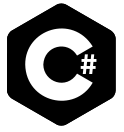

<h1 align="left" id="revalt-title">:wave: Hello there! I'm Rifal Ali!</h1>

### Glad to see you here! &nbsp;

I am a Programmer currently do stuff in Fullstack Development / Game Development / Software Engineering with the aim of creating projects that have beneficial to the environment. 🚀

### Talking about Personal Stuff:

- 🛠 &nbsp; I’m currently working with C#, Kotlin, PHP, etc.
- 🚀 &nbsp; I’m currently exploring Desktop, Android, Web, etc.
- :speech_balloon: &nbsp; I like to talk and discuss about **Algorithms**
- 📫 &nbsp; Ask me anything on my **social media** or **email**.
- 👾 &nbsp; Quote: "If you can get 1% better each day for one year, you'll end up 37 times better by the time you're done."
- :computer: &nbsp; Reach me out: alirifal485@gmail.com.

<h2 align="left" id="revalt-tech">Favorite Tech</h2>

> Tools, languages, and other things that I like to work with.

<table>
  <tr>
    <td align="center" width="96">
      
       C#
    </td>
    <td align="center" width="96">
      
       Kotlin
    </td>
    <td align="center" width="96">
      
       PHP
    </td>
    <td align="center" width="96">
      
       Node JS
    </td>
    <td align="center" width="96">
      
       MySQL
    </td>
  </tr>
</table>

